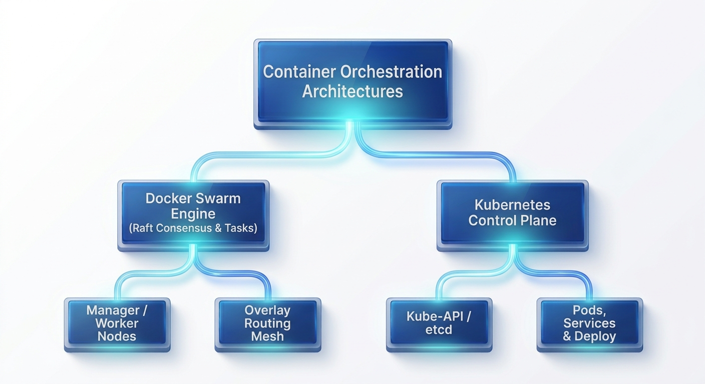

# Chapter 4: 702.2 Container Orchestration & Clustering (Docker Swarm & Kubernetes Fundamentals)

## 1. Objective Architecture & Theoretical Foundations

Container orchestration automates the deployment, scaling, networking, and lifecycle management of containerized workloads across multi-node clusters. This chapter covers Docker Swarm and Kubernetes fundamentals as specified in the LPIC DevOps Tools Engineer (Exam 701) exam objectives 


```
                    +-------------------------------------------------+
                    |       Container Orchestration Architectures     |
                    +-------------------------------------------------+
                                            |
                +---------------------------+---------------------------+
                |                                                       |
                v                                                       v
   +--------------------------+                               +-------------------+
   |   Docker Swarm Engine    |                               |    Kubernetes     |
   | (Raft Consensus & Tasks) |                               | Control Plane     |
   +--------------------------+                               +-------------------+
                |                                                       |
         +------+------+                                         +------+------+
         |             |                                         |             |
         v             v                                         v             v
   +-----------+ +-----------+                             +-----------+ +-----------+
   | Manager / | | Overlay   |                             | Kube-     | | Pods,     |
   | Worker    | | Routing   |                             | API /     | | Services  |
   | Nodes     | | Mesh      |                             | etcd      | | & Deploy  |
   +-----------+ +-----------+                             +-----------+ +-----------+

```

### Docker Swarm Mechanics & Clustering

* **Manager vs. Worker Nodes:** Manager nodes handle cluster management tasks, maintain cluster state, schedule services, and serve Swarm HTTP endpoints. Worker nodes receive and execute tasks dispatched by manager nodes.
* **Raft Consensus Protocol:** Swarm managers use the Raft consensus algorithm to maintain consistent cluster state. A high-availability quorum requires an odd number of manager nodes ($N = 2F + 1$, where $F$ is the maximum number of tolerable node failures).
* **Routing Mesh:** Built-in ingress networking that routes incoming traffic on exposed service ports to active containers across any cluster node, regardless of whether the node is currently running the target container.
* **Services, Tasks, & Stacks:**
* **Service:** Declarative definition of container state (image, ports, replicas, networks).
* **Task:** Individual running container instance managed by Swarm.
* **Stack:** Multi-service application deployment defined via declarative Compose-style YAML files using `docker stack deploy`.


### Kubernetes Architecture & Primitives

* **Control Plane Components:**
* `kube-apiserver`: Exposes the Kubernetes API and serves as the central communication hub.
* `etcd`: Distributed key-value store holding the complete cluster configuration and state.
* `kube-scheduler`: Assigns newly created Pods to optimal worker nodes based on resource constraints.
* `kube-controller-manager`: Executes control loops that reconcile cluster state (e.g., ReplicaSet controller, Node controller).


* **Worker Node Components:**
* `kubelet`: Primary node agent that ensures containers defined in PodSpecs are running and healthy.
* `kube-proxy`: Maintains network rules on nodes to handle service IP routing and traffic forwarding.
* Container Runtime: The underlying software responsible for running containers (e.g., `containerd`, `CRI-O`).


* **Kubernetes API Objects:**
* **Pod:** The smallest deployable unit in Kubernetes, containing one or more co-located containers sharing network and storage namespaces.
* **Deployment:** Declaratively manages ReplicaSets and Pod updates, enabling zero-downtime rolling updates and rollbacks.
* **Service:** Stable network abstraction that exposes a group of Pods via fixed IP endpoints (`ClusterIP`, `NodePort`, `LoadBalancer`).
* **ConfigMap & Secret:** Decouples configuration data and sensitive credentials from container application code.


---

## 2. Real-World Production Scenario

### System Under Outage & Scaling Failure

A enterprise e-commerce backend running on an un-orchestrated Docker host experiences dropping connections under high load. Deployments cause temporary service downtime, container failures require manual intervention, and internal services lack load balancing.

```
[ Legacy Deployment: Single-Host Static Setup ]
+-----------------------------------------------------------------+
| Docker Host (Single Point of Failure)                           |
|  - Manual container restarts on failure                         |
|  - Downtime during image deployments                            |
|  - Hardcoded local networking                                   |
+-----------------------------------------------------------------+
                                  |
                                  |  ORCHESTRATION MIGRATION PIPELINE
                                  v
[ Orchestrated High-Availability Architecture ]
+-----------------------------------------------------------------+
| Docker Swarm / Kubernetes Multi-Node Cluster                     |
|  - Multi-replica Deployment with Automated Self-Healing         |
|  - Zero-Downtime Rolling Upgrades with Health Checks            |
|  - Ingress Routing Mesh & Service-Based Load Balancing          |
|  - Decoupled Secrets & Dynamic Scaling                          |
+-----------------------------------------------------------------+

```

### Architectural Objectives

1. Initialize a Docker Swarm cluster and deploy a multi-service stack with overlay networking and health checks.
2. Execute a zero-downtime rolling update across container replicas.
3. Author production-ready Kubernetes manifests (`Deployment`, `Service`, `ConfigMap`).
4. Perform node maintenance draining and workload recovery procedures.

---

## 3. Hands-On Step-by-Step Implementation Lab

### Lab Environment Setup

Create a dedicated working directory for orchestration manifests:

```bash
mkdir -p devops-701-orchestration-lab && cd devops-701-orchestration-lab

```

---

### Part A: Docker Swarm Orchestration

#### Step 1: Initializing Docker Swarm & Creating Overlay Networks

Initialize Swarm mode on the primary host node:

```bash
docker swarm init --advertise-addr 127.0.0.1

```

Create an encrypted multi-host overlay network:

```bash
docker network create --driver overlay --opt encrypted swarm-net

```

#### Step 2: Deploying a Scalable Multi-Service Stack

Create a Swarm Stack specification file (`docker-stack.yml`):

```yaml
version: '3.8'

services:
  web-app:
    image: nginx:1.25-alpine
    ports:
      - "8080:80"
    networks:
      - swarm-net
    deploy:
      mode: replicated
      replicas: 4
      update_config:
        parallelism: 2
        delay: 5s
        order: start-first
        failure_action: rollback
      restart_policy:
        condition: on-failure
        delay: 5s
        max_attempts: 3
    healthcheck:
      test: ["CMD", "wget", "-q", "--spider", "http://localhost/"]
      interval: 5s
      timeout: 3s
      retries: 3

  backend-api:
    image: redis:7-alpine
    networks:
      - swarm-net
    deploy:
      mode: replicated
      replicas: 2
      placement:
        constraints:
          - node.role == manager

networks:
  swarm-net:
    external: true

```

Deploy the stack to the Swarm cluster:

```bash
docker stack deploy -c docker-stack.yml production-stack

```

#### Step 3: Executing Rolling Upgrades & Node Maintenance

Perform a zero-downtime rolling update to change the application image:

```bash
docker service update --image nginx:1.26-alpine production-stack_web-app

```

Simulate draining a node for system maintenance:

```bash
NODE_ID=$(docker node ls -q | head -n 1)
docker node update --availability drain $NODE_ID

```

Re-enable the node after maintenance:

```bash
docker node update --availability active $NODE_ID

```

---

### Part B: Kubernetes Core Fundamentals

#### Step 1: Authoring Kubernetes Declarative Manifests

Create a unified Kubernetes deployment manifest (`k8s-app.yaml`) containing a `ConfigMap`, `Deployment`, and `Service`:

```yaml
apiVersion: v1
kind: ConfigMap
metadata:
  name: app-config
  labels:
    app: production-web
data:
  APP_ENV: "production"
  LOG_LEVEL: "info"
---
apiVersion: apps/v1
kind: Deployment
metadata:
  name: production-web-deployment
  labels:
    app: production-web
spec:
  replicas: 3
  strategy:
    type: RollingUpdate
    rollingUpdate:
      maxSurge: 1
      maxUnavailable: 0
  selector:
    matchLabels:
      app: production-web
  template:
    metadata:
      labels:
        app: production-web
    spec:
      containers:
      - name: web-container
        image: nginx:1.25-alpine
        ports:
        - containerPort: 80
        envFrom:
        - configMapRef:
            name: app-config
        resources:
          limits:
            cpu: "250m"
            memory: "128Mi"
          requests:
            cpu: "100m"
            memory: "64Mi"
        livenessProbe:
          httpGet:
            path: /
            port: 80
          initialDelaySeconds: 5
          periodSeconds: 10
        readinessProbe:
          httpGet:
            path: /
            port: 80
          initialDelaySeconds: 3
          periodSeconds: 5
---
apiVersion: v1
kind: Service
metadata:
  name: production-web-service
spec:
  type: NodePort
  ports:
  - port: 80
    targetPort: 80
    nodePort: 30080
  selector:
    app: production-web

```

#### Step 2: Deploying & Managing Kubernetes Resources

Apply the manifests using `kubectl`:

```bash
kubectl apply -f k8s-app.yaml

```

Scale the deployment dynamically:

```bash
kubectl scale deployment production-web-deployment --replicas=5

```

---

## 4. Verification & Validation Steps

### 1. Verify Docker Swarm Stack & Services

Confirm that Swarm services are running with expected replica counts:

```bash
docker stack services production-stack

```

*Expected Output:*

```text
ID             NAME                     MODE         REPLICAS   IMAGE              PORTS
abc123def456   production-stack_web-app   replicated   4/4        nginx:1.26-alpine   *:8080->80/tcp
xyz789ghi012   production-stack_backend  replicated   2/2        redis:7-alpine     

```

Inspect task placement across the cluster:

```bash
docker stack ps production-stack

```

### 2. Validate Swarm Rolling Upgrade Status

Check service details to verify the rolling update succeeded without dropping replicas:

```bash
docker service ps production-stack_web-app

```

### 3. Verify Kubernetes Deployment & Pod Readiness

Check the status of deployed Kubernetes resources:

```bash
kubectl get pods,deployments,services -l app=production-web

```

*Expected Output:*

```text
NAME                                            READY   STATUS    RESTARTS   AGE
pod/production-web-deployment-7d9b89895-4k8x2   1/1     Running   0          45s
pod/production-web-deployment-7d9b89895-7h2p9   1/1     Running   0          45s
pod/production-web-deployment-7d9b89895-9l4m1   1/1     Running   0          45s

NAME                                          READY   UP-TO-DATE   AVAILABLE   AGE
deployment.apps/production-web-deployment   3/3     3            3           45s

NAME                             TYPE       CLUSTER-IP      EXTERNAL-IP   PORT(S)        AGE
service/production-web-service   NodePort   10.96.120.150   <none>        80:30080/TCP   45s

```

### 4. Test Ingress Routing Mesh & Endpoints

Query the application endpoint to verify traffic routing:

```bash
curl -i http://localhost:8080

```

*Expected Output:* `HTTP/1.1 200 OK` from Nginx.

---

## 5. Command & Tool Quick Reference

| Command / Flag | Purpose / Objective | Example Usage |
| --- | --- | --- |
| `docker swarm init` | Initializes a Docker Swarm manager node on the current host. | `docker swarm init --advertise-addr <IP>` |
| `docker stack deploy -c` | Deploys or updates a multi-service stack from a Compose YAML file. | `docker stack deploy -c stack.yml my-app` |
| `docker node update --availability` | Sets node availability state (`active`, `pause`, `drain`). | `docker node update --availability drain node-01` |
| `kubectl apply -f` | Declaratively creates or updates Kubernetes resources defined in a file. | `kubectl apply -f deployment.yaml` |
| `kubectl rollout status` | Monitors the progress of a deployment rolling update. | `kubectl rollout status deployment/web-app` |
| `kubectl get pods -o wide` | Lists Pods with detailed information, including assigned worker node and Pod IP. | `kubectl get pods -o wide` |

---

## 6. Exam-Style Self-Assessment Questions

### Question 1

A DevOps engineer is configuring a Docker Swarm cluster with 5 Manager nodes to ensure high availability. What is the maximum number of Manager node failures ($F$) the cluster can tolerate while maintaining Raft consensus quorum?

A. 1 Manager node failure

B. 2 Manager node failures

C. 3 Manager node failures

D. 4 Manager node failures

### Question 2

In Kubernetes, which control plane component is responsible for monitoring newly created Pods that lack an assigned node and selecting a suitable worker node for them to run on?

A. `kube-controller-manager`

B. `kube-apiserver`

C. `etcd`

D. `kube-scheduler`

---

### Answer Key & Explanations

#### Question 1

* **Correct Answer:** **B**
* **Explanation:** The Raft consensus formula for quorum is $N = 2F + 1$, where $N$ is the total number of manager nodes and $F$ is the number of allowable failures. For $N = 5$: $5 = 2F + 1 \implies 2F = 4 \implies F = 2$. Therefore, a 5-manager cluster can tolerate up to 2 manager node failures while maintaining operational quorum.

#### Question 2

* **Correct Answer:** **D**
* **Explanation:** The `kube-scheduler` monitors the `kube-apiserver` for unassigned Pods and selects worker nodes for them based on resource requests, taints/tolerations, affinity rules, and node availability. `kube-controller-manager` handles state controllers, `kube-apiserver` serves API requests, and `etcd` stores cluster state.
                    
                    +-------------------------------------------------+
                    |       Container Orchestration Architectures     |
                    +-------------------------------------------------+
                                            |
                +---------------------------+---------------------------+
                |                                                       |
                v                                                       v
   +--------------------------+                               +-------------------+
   |   Docker Swarm Engine    |                               |    Kubernetes     |
   | (Raft Consensus & Tasks) |                               | Control Plane     |
   +--------------------------+                               +-------------------+
                |                                                       |
         +------+------+                                         +------+------+
         |             |                                         |             |
         v             v                                         v             v
   +-----------+ +-----------+                             +-----------+ +-----------+
   | Manager / | | Overlay   |                             | Kube-     | | Pods,     |
   | Worker    | | Routing   |                             | API /     | | Services  |
   | Nodes     | | Mesh      |                             | etcd      | | & Deploy  |
   +-----------+ +-----------+                             +-----------+ +-----------+

### Container Orchestration Architectures Diagram explained

This text-based diagram illustrates a comparative overview of the two major container orchestration architectures covered in the LPIC-701 exam: **Docker Swarm** and **Kubernetes**.

It breaks down each system from its high-level engine type down to its core operational components.

---

### 1. The Top Level: Core Orchestration Engines

The diagram begins by splitting orchestration into two distinct foundational engines:

#### **Docker Swarm Engine (Raft Consensus & Tasks)**

* **Context:** This represents Docker’s native, built-in orchestration solution. It is included within the Docker Engine itself.
* **Key Concept (Raft Consensus):** Swarm uses the Raft Consensus Algorithm among its manager nodes to ensure a consistent cluster state. This is how the cluster agrees on which services should be running and where.
* **Key Concept (Tasks):** In Swarm, the atomic unit of scheduling is a "Task" (essentially a running container plus the instructions on how to run it).

#### **Kubernetes Control Plane**

* **Context:** This represents the brain of a Kubernetes cluster. Unlike Swarm, Kubernetes is typically a distinct system from the underlying container runtime.
* **Key Concept (Control Plane):** The Control Plane is the collection of components (like the API server, scheduler, and controller manager) that make global decisions about the cluster (e.g., scheduling), and detect and respond to cluster events.

---

### 2. The Component Level: Nodes and Primitives

The lower tier of the diagram shows the fundamental building blocks used by each engine to execute workloads and manage networking.

#### **Docker Swarm Components**

1. **Manager / Worker Nodes:**
* **Role Separation:** Swarm strictly distinguishes node roles.
* **Manager Nodes:** Handle cluster management, service scheduling, and maintaining the Raft quorum.
* **Worker Nodes:** Receive and execute tasks (containers) dispatched from the managers.


2. **Overlay Routing Mesh:**
* **Networking:** This is Swarm's powerful, built-in ingress networking feature. It creates a virtual network spanning all nodes in the swarm.
* **Function:** It allows any node in the swarm to accept connections on a published service port and route that traffic to an active container running that service, regardless of which node the container is actually on.


#### **Kubernetes Components**

1. **Kube-API / etcd:**
* **Kube-API Server:** The front end of the control plane. All components (internal and external) communicate through this API.
* **etcd:** The cluster’s brain. It is a highly available, distributed key-value store used as Kubernetes' back-end for all cluster data (configurations, state, secrets). If `etcd` is lost, the cluster state is lost.


2. **Pods, Services & Deploy:**
* **API Objects:** These are the primary declarative objects defined in YAML that users interact with.
* **Pod:** The smallest deployable unit in Kubernetes (wrapping one or more containers).
* **Service:** An abstract way to expose an application running on a set of Pods as a network service (providing stable networking and load balancing).
* **Deployment:** A controller that provides declarative updates for Pods and ReplicaSets (handling rolling updates and scaling).

                    +-------------------------------------------------+
                    |       Container Orchestration Architectures     |
                    +-------------------------------------------------+
                                            |
                +---------------------------+---------------------------+
                |                                                       |
                v                                                       v
   +--------------------------+                               +-------------------+
   |   Docker Swarm Engine    |                               |    Kubernetes     |
   | (Raft Consensus & Tasks) |                               | Control Plane     |
   +--------------------------+                               +-------------------+
                |                                                       |
         +------+------+                                         +------+------+
         |             |                                         |             |
         v             v                                         v             v
   +-----------+ +-----------+                             +-----------+ +-----------+
   | Manager / | | Overlay   |                             | Kube-     | | Pods,     |
   | Worker    | | Routing   |                             | API /     | | Services  |
   | Nodes     | | Mesh      |                             | etcd      | | & Deploy  |
   +-----------+ +-----------+                             +-----------+ +-----------+
   
### Container Orchestration Architectures Diagram explained

This text-based diagram illustrates a comparative overview of the two major container orchestration architectures covered in the LPIC-701 exam: **Docker Swarm** and **Kubernetes**.

It breaks down each system from its high-level engine type down to its core operational components.

---

### 1. The Top Level: Core Orchestration Engines

The diagram begins by splitting orchestration into two distinct foundational engines:

#### **Docker Swarm Engine (Raft Consensus & Tasks)**

* **Context:** This represents Docker’s native, built-in orchestration solution. It is included within the Docker Engine itself.
* **Key Concept (Raft Consensus):** Swarm uses the Raft Consensus Algorithm among its manager nodes to ensure a consistent cluster state. This is how the cluster agrees on which services should be running and where.
* **Key Concept (Tasks):** In Swarm, the atomic unit of scheduling is a "Task" (essentially a running container plus the instructions on how to run it).

#### **Kubernetes Control Plane**

* **Context:** This represents the brain of a Kubernetes cluster. Unlike Swarm, Kubernetes is typically a distinct system from the underlying container runtime.
* **Key Concept (Control Plane):** The Control Plane is the collection of components (like the API server, scheduler, and controller manager) that make global decisions about the cluster (e.g., scheduling), and detect and respond to cluster events.

---

### 2. The Component Level: Nodes and Primitives

The lower tier of the diagram shows the fundamental building blocks used by each engine to execute workloads and manage networking.

#### **Docker Swarm Components**

1. **Manager / Worker Nodes:**
* **Role Separation:** Swarm strictly distinguishes node roles.
* **Manager Nodes:** Handle cluster management, service scheduling, and maintaining the Raft quorum.
* **Worker Nodes:** Receive and execute tasks (containers) dispatched from the managers.


2. **Overlay Routing Mesh:**
* **Networking:** This is Swarm's powerful, built-in ingress networking feature. It creates a virtual network spanning all nodes in the swarm.
* **Function:** It allows any node in the swarm to accept connections on a published service port and route that traffic to an active container running that service, regardless of which node the container is actually on.


#### **Kubernetes Components**

1. **Kube-API / etcd:**
* **Kube-API Server:** The front end of the control plane. All components (internal and external) communicate through this API.
* **etcd:** The cluster’s brain. It is a highly available, distributed key-value store used as Kubernetes' back-end for all cluster data (configurations, state, secrets). If `etcd` is lost, the cluster state is lost.


2. **Pods, Services & Deploy:**
* **API Objects:** These are the primary declarative objects defined in YAML that users interact with.
* **Pod:** The smallest deployable unit in Kubernetes (wrapping one or more containers).
* **Service:** An abstract way to expose an application running on a set of Pods as a network service (providing stable networking and load balancing).
* **Deployment:** A controller that provides declarative updates for Pods and ReplicaSets (handling rolling updates and scaling).
                    
                    +-------------------------------------------------+
                    |       Container Orchestration Architectures     |
                    +-------------------------------------------------+
                                            |
                +---------------------------+---------------------------+
                |                                                       |
                v                                                       v
   +--------------------------+                               +-------------------+
   |   Docker Swarm Engine    |                               |    Kubernetes     |
   | (Raft Consensus & Tasks) |                               | Control Plane     |
   +--------------------------+                               +-------------------+
                |                                                       |
         +------+------+                                         +------+------+
         |             |                                         |             |
         v             v                                         v             v
   +-----------+ +-----------+                             +-----------+ +-----------+
   | Manager / | | Overlay   |                             | Kube-     | | Pods,     |
   | Worker    | | Routing   |                             | API /     | | Services  |
   | Nodes     | | Mesh      |                             | etcd      | | & Deploy  |
   +-----------+ +-----------+                             +-----------+ +-----------+
   
This text-based architecture diagram provides a simplified, comparative overview of the two primary container orchestration ecosystems covered by the LPIC-701 exam objectives: **Docker Swarm** and **Kubernetes**.

The diagram visualizes how these systems differ structurally, moving from the high-level management engine down to the operational nodes and functional primitives.

---

### Tier 1: Core Orchestration Engines

This tier separates the fundamental management philosophies of the two systems.

#### 1. Docker Swarm Engine (Raft Consensus & Tasks)

* **Engine Type:** This represents the built-in orchestration capabilities native to the Docker Engine. If you have Docker installed, you have the Swarm engine.
* **Key Concept (Raft Consensus):** Swarm Managers use the Raft Consensus Algorithm to agree on the cluster's state (which services are running, how many replicas, which nodes are healthy). This ensures high availability and state consistency among the management tier.
* **Key Concept (Tasks):** In Swarm, the atomic unit of scheduling is a **Task**. A Task is the combination of a Docker container and the commands required to run it, as dispatched by a manager to a worker node.

#### 2. Kubernetes Control Plane

* **Engine Type:** This represents the "brain" or the central management assembly of a Kubernetes cluster. Kubernetes is typically distinct from the underlying container runtime (like `containerd`).
* **Key Concept (Control Plane):** This is a collection of distinct components (running on master nodes) responsible for maintaining the desired state of the cluster. It handles scheduling, responding to cluster events, and managing the API.

---

### Tier 2: Components and Primitives

This tier illustrates the building blocks used by each engine to execute workloads and manage resources.

#### Docker Swarm Components

1. **Manager / Worker Nodes:**
* **Architecture:** Swarm has a straightforward node-role distinction.
* **Manager Nodes:** Handle cluster management tasks, accept API requests, and maintain the Raft quorum.
* **Worker Nodes:** Receive and execute tasks (containers) from the managers. By default, Managers also act as Workers.


2. **Overlay Routing Mesh:**
* **Networking:** This is Swarm’s powerful, embedded ingress networking feature.
* **Function:** It creates a routing network spanning every node in the Swarm. It allows a service to be reached on its published port on *any* node in the cluster, regardless of which node is actually hosting the running container task. The traffic is automatically routed internally to the correct task.


#### Kubernetes Components

1. **Kube-API / etcd:**
* **Kube-API Server:** The front-end validation and configuration hub of the control plane. All components (kubectl, workers, internal controllers) communicate only with the API server.
* **etcd:** The cluster’s critical "source of truth." It is a distributed, consistent key-value store that holds all cluster data—configuration, state, secrets, and taints. Losing etcd means losing the cluster configuration.


2. **Pods, Services & Deploy:**
* **Primitives:** These represent the primary API Objects defined in Kubernetes YAML manifests that users interact with.
* **Pod:** The smallest deployable unit in Kubernetes (one or more tightly coupled containers).
* **Service:** A stable network abstraction that provides an IP address and load balancing for a dynamic set of backend Pods.
* **Deployment:** A higher-level controller used to declaratively manage Pods and ReplicaSets, handling scaling, rolling updates, and self-healing.

This text-based diagram provides a simplified, comparative overview of the two primary container orchestration ecosystems covered by the LPIC-701 exam objectives: **Docker Swarm** and **Kubernetes**.

The diagram visualizes how these systems differ structurally, moving from the high-level management engine down to the operational nodes and functional primitives.

---

### Tier 1: Core Orchestration Engines

This tier separates the fundamental management philosophies of the two systems.

#### 1. Docker Swarm Engine (Raft Consensus & Tasks)

* **Engine Type:** This represents the built-in orchestration capabilities native to the Docker Engine. If you have Docker installed, you have the Swarm engine.
* **Key Concept (Raft Consensus):** Swarm Managers use the Raft Consensus Algorithm to agree on the cluster's state (which services are running, how many replicas, which nodes are healthy). This ensures high availability and state consistency among the management tier.
* **Key Concept (Tasks):** In Swarm, the atomic unit of scheduling is a **Task**. A Task is the combination of a Docker container and the commands required to run it, as dispatched by a manager to a worker node.

#### 2. Kubernetes Control Plane

* **Engine Type:** This represents the "brain" or the central management assembly of a Kubernetes cluster. Kubernetes is typically distinct from the underlying container runtime (like `containerd`).
* **Key Concept (Control Plane):** This is a collection of distinct components (running on master nodes) responsible for maintaining the desired state of the cluster. It handles scheduling, responding to cluster events, and managing the API.

---

### Tier 2: Components and Primitives

This tier illustrates the building blocks used by each engine to execute workloads and manage resources.

#### Docker Swarm Components

1. **Manager / Worker Nodes:**
* **Architecture:** Swarm has a straightforward node-role distinction.
* **Manager Nodes:** Handle cluster management tasks, accept API requests, and maintain the Raft quorum.
* **Worker Nodes:** Receive and execute tasks (containers) from the managers. By default, Managers also act as Workers.


2. **Overlay Routing Mesh:**
* **Networking:** This is Swarm’s powerful, embedded ingress networking feature.
* **Function:** It creates a routing network spanning every node in the Swarm. It allows a service to be reached on its published port on *any* node in the cluster, regardless of which node is actually hosting the running container task. The traffic is automatically routed internally to the correct task.


#### Kubernetes Components

1. **Kube-API / etcd:**
* **Kube-API Server:** The front-end validation and configuration hub of the control plane. All components (kubectl, workers, internal controllers) communicate only with the API server.
* **etcd:** The cluster’s critical "source of truth." It is a distributed, consistent key-value store that holds all cluster data—configuration, state, secrets, and taints. Losing etcd means losing the cluster configuration.


2. **Pods, Services & Deploy:**
* **Primitives:** These represent the primary API Objects defined in Kubernetes YAML manifests that users interact with.
* **Pod:** The smallest deployable unit in Kubernetes (one or more tightly coupled containers).
* **Service:** A stable network abstraction that provides an IP address and load balancing for a dynamic set of backend Pods.
* **Deployment:** A higher-level controller used to declaratively manage Pods and ReplicaSets, handling scaling, rolling updates, and self-healing.


