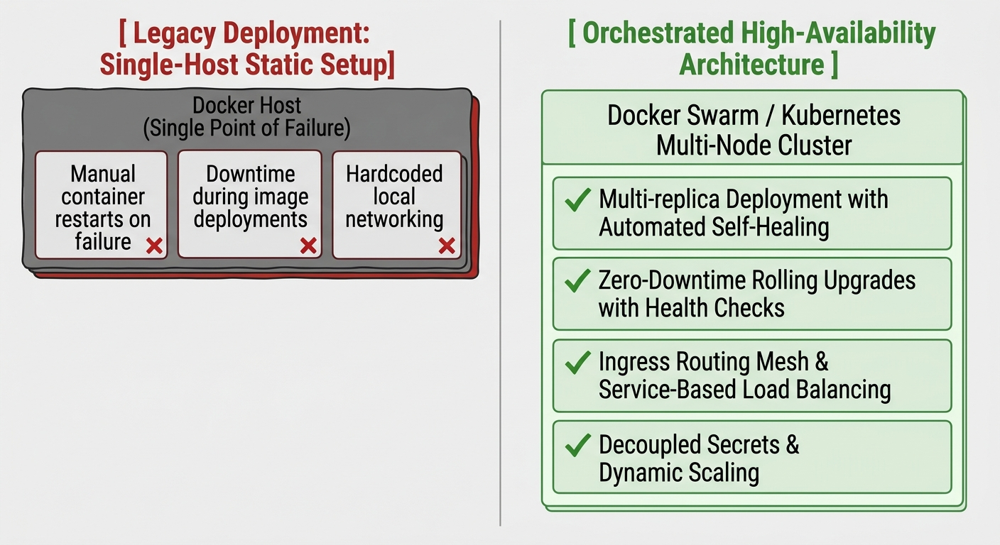

```markdown
# Chapter 5: Advanced Container Orchestration & Clustering (Docker Swarm & Kubernetes Fundamentals)

## 5.1 Orchestration Paradigm Shift: Single-Host vs. Clustered Operations

Deploying containers on a single host introduces severe single-point-of-failure (SPOF) risks and operational bottlenecks. As applications scale, orchestration platforms automate process scheduling, state management, inter-host networking, and fault tolerance across a cluster of nodes.


```

```
   [ Legacy Deployment: Single-Host Static Setup ]

```

+-----------------------------------------------------------------+
| Docker Host (Single Point of Failure)                           |
|  - Manual container restarts on failure                         |
|  - Downtime during image deployments                            |
|  - Hardcoded local networking                                   |
+-----------------------------------------------------------------+
|
|  ORCHESTRATION MIGRATION PIPELINE
v
[ Orchestrated High-Availability Architecture ]
+-----------------------------------------------------------------+
| Docker Swarm / Kubernetes Multi-Node Cluster                    |
|  - Multi-replica Deployment with Automated Self-Healing         |
|  - Zero-Downtime Rolling Upgrades with Health Checks            |
|  - Ingress Routing Mesh & Service-Based Load Balancing          |
|  - Decoupled Secrets & Dynamic Scaling                          |
+-----------------------------------------------------------------+

```

### Architectural Comparison Matrix

| Operational Feature | Single-Host (`docker run` / Compose) | Docker Swarm | Kubernetes (k8s) |
| :--- | :--- | :--- | :--- |
| **Scheduling Unit** | Single Container | Service Task | Pod (1 or more containers) |
| **State Reconciler** | None (Imperative execution) | Swarm Manager Raft Engine | `kube-controller-manager` + `etcd` |
| **Networking** | Local `bridge` / `host` | Overlay VXLAN (Ingress Mesh) | CNI Plugin (Flannel, Calico, Cilium) |
| **Configuration Storage** | Local Bind Mounts / `.env` | Native Swarm Configs / Secrets | `ConfigMap` / `Secret` objects |
| **Service Discovery** | Static DNS (`/etc/hosts` / Embedded DNS) | Virtual IP (VIP) + Routing Mesh | CoreDNS + ClusterIP Service Abstraction |

---

## 5.2 Docker Swarm Architecture & High Availability Engine

Docker Swarm converts a pool of Docker hosts into a single, virtual host. Its architecture relies on two core node types managed via an embedded Raft Consensus implementation:

*   **Manager Nodes:** Execute the Raft Consensus algorithm, maintain cluster state in an internal distributed database, listen for API requests, and dispatch task assignments.
*   **Worker Nodes:** Receive and execute tasks assigned by Manager nodes. They run an instance of `dockerd` and report process health metrics back to the cluster control plane.

### 5.2.1 High Availability & Raft Consensus Quorum Rules

To maintain cluster consistency and prevent split-brain scenarios, Swarm requires a strict majority quorum of Manager nodes. Given $N$ manager nodes, the minimum quorum size $Q$ required to execute cluster modifications is defined by:

$$Q = \left\lfloor \frac{N}{2} \right\rfloor + 1$$

The maximum number of simultaneous manager node failures ($F$) that a Swarm cluster can tolerate without losing state consensus is:

$$F = \left\lfloor \frac{N - 1}{2} \right\rfloor$$


```

+-------------------+--------------------+-------------------+
| Total Managers (N)| Quorum Required (Q)| Max Failures (F)  |
+-------------------+--------------------+-------------------+
|         1         |         1          |         0         |
|         3         |         2          |         1         |
|         5         |         3          |         2         |
|         7         |         4          |         3         |
+-------------------+--------------------+-------------------+

```

> **Production Standard:** Always maintain an odd number of Manager nodes (typically 3 or 5). Adding a 4th manager does not increase fault tolerance ($F=1$ for both 3 and 4 managers), but it increases network overhead during Raft consensus synchronization.

---

## 5.3 Hands-On Lab: Deploying a Secure Docker Swarm Cluster

### 5.3.1 Step 1: Initialize Swarm Control Plane

Execute the swarm initialization command on the designated primary manager node (`node-01`). Ensure you bind explicitly to the internal management IP address:

```bash
# Initialize Swarm Manager on node-01
sudo docker swarm init --advertise-addr 192.168.10.10

```

*Output Verification:*

```text
Swarm initialized: current node (p8m9zq1l3x8v9u1a7k1x2z3y4) is now a manager.

To add a worker to this swarm, run the following command:
    docker swarm join --token SWMTKN-1-49mgr84a3x... 192.168.10.10:2377

To add a manager to this swarm, run 'docker swarm join-token manager' and follow the instructions.

```

### 5.3.2 Step 2: Retrieve Join Tokens and Scale Nodes

To securely join additional worker nodes (`node-02`, `node-03`) to the cluster, retrieve the worker join token from the manager:

```bash
# Display the joining token for workers
sudo docker swarm join-token worker

```

Run the resulting command on **Worker Nodes** (`node-02` and `node-03`):

```bash
# Execute on node-02 and node-03
sudo docker swarm join --token SWMTKN-1-49mgr84a3x5v9u1a7k1x2z3y4-8x7v6c5b4n3m2a1 192.168.10.10:2377

```

Verify cluster state on the Manager Node (`node-01`):

```bash
sudo docker node ls

```

*Expected Output:*

```text
ID                            HOSTNAME   STATUS   AVAILABILITY   MANAGER STATUS   ENGINE VERSION
p8m9zq1l3x8v9u1a7k1x2z3y4 *   node-01    Ready    Active         Leader           26.1.0
w1k2j3h4g5f6d7s8a9p0o1i2u     node-02    Ready    Active                          26.1.0
m9n8b7v6c5x4z3l2k1j0h9g8f     node-03    Ready    Active                          26.1.0

```

---

## 5.4 Docker Overlay Networking & Swarm Secrets

Swarm leverages an encrypted Overlay network (VXLAN encapsulation) to span across all nodes in the cluster, routing external connections to active container tasks via an Ingress Routing Mesh.

```
       +-------------------------------------------------------+
       |                  External Client                      |
       +-------------------------------------------------------+
                                   |
                                   v (Port 8080)
      +----------------------------+----------------------------+
      |                                                         |
      v                                                         v
+--------------------------+               +--------------------------+
|  Swarm Node 01 (Worker)  |               |  Swarm Node 02 (Worker)  |
|  [Ingress Routing Mesh]  |               |  [Ingress Routing Mesh]  |
|            |             |               |            |             |
|            v             |               |            v             |
|   (No Container Running) |               |  App Task Container      |
|            |             |               |  (Listening on port 80)   |
+------------|-------------+               +--------------------------+
             |                                          ^
             +================ (VXLAN Tunnel) ==========+

```

### 5.4.1 Production Hands-On: Provision Overlay Network and Encrypted Secret

1. **Create a scoped Overlay Network:**
```bash
sudo docker network create \
  --driver overlay \
  --attachable \
  --subnet 10.0.99.0/24 \
  prod-overlay-net

```


2. **Provision an Encrypted Swarm Secret:**
```bash
echo "SuperSecretProductionDatabasePassword2026!" | \
  sudo docker secret create db_prod_password -

```


3. **Deploy a Highly Available Replicated Web Service:**
```bash
sudo docker service create \
  --name secure-web-app \
  --replicas 3 \
  --network prod-overlay-net \
  --secret db_prod_password \
  --publish published=8080,target=80 \
  --update-delay 10s \
  --update-failure-action rollback \
  --rollback-parallelism 1 \
  nginx:alpine

```


4. **Verify Tasks and Secrets Attachment:**
```bash
sudo docker service ps secure-web-app

```


*Inspect the secret inside one of the running tasks:*
```bash
# Execute inside a container task to verify in-memory mount
CONTAINER_ID=$(sudo docker ps -q -f name=secure-web-app.1)
sudo docker exec -it $CONTAINER_ID cat /run/secrets/db_prod_password

```


---

## 5.5 Production Stack Deployment via Declarative Compose Schema

For complex, multi-tier microservice architectures, Swarm uses declarative Stack files (`docker-stack.yml`).

### 5.5.1 Manifest Construction: `docker-stack.yml`

Create a production deployment stack incorporating health checks, resource bounds, placement constraints, and rolling update strategies:

```yaml
version: '3.8'

services:
  web:
    image: nginx:alpine
    ports:
      - "80:80"
    networks:
      - app-net
    deploy:
      mode: replicated
      replicas: 4
      placement:
        constraints:
          - node.role == worker
      resources:
        limits:
          cpus: '0.50'
          memory: 256M
        reservations:
          cpus: '0.10'
          memory: 64M
      restart_policy:
        condition: on-failure
        delay: 5s
        max_attempts: 3
      update_config:
        parallelism: 2
        delay: 10s
        order: start-first
        failure_action: rollback

  redis:
    image: redis:7-alpine
    networks:
      - app-net
    deploy:
      mode: replicated
      replicas: 1
      placement:
        constraints:
          - node.role == manager
    healthcheck:
      test: ["CMD", "redis-cli", "ping"]
      interval: 5s
      timeout: 3s
      retries: 3

networks:
  app-net:
    driver: overlay
    ipam:
      config:
        - subnet: 172.28.0.0/16

```

### 5.5.2 Deploying and Managing the Swarm Stack

Execute the deployment using the built-in stack engine:

```bash
# Deploy stack declarative configuration
sudo docker stack deploy -c docker-stack.yml enterprise_stack

# List active stacks
sudo docker stack ls

# List tasks within the deployed stack
sudo docker stack ps enterprise_stack

```

---

## 5.6 Fundamentals of Kubernetes (k8s) & Cluster Control Plane

Kubernetes is an open-source, production-grade container orchestration system that automates the deployment, scaling, and management of containerized applications across node clusters.

```
+-----------------------------------------------------------------------------------+
|                                KUBERNETES CLUSTER                                 |
|                                                                                   |
|  +-----------------------------------------------------------------------------+  |
|  |                            CONTROL PLANE (MASTER)                           |  |
|  |  +---------------+  +------------------+  +---------------+  +------------+ |  |
|  |  |   kube-apiserver  |  | kube-scheduler   |  | controller-mgr|  |    etcd    | |  |
|  |  +---------------+  +------------------+  +---------------+  +------------+ |  |
|  +-----------------------------------|-----------------------------------------+  |
|                                      |                                            |
|            +-------------------------+-------------------------+                  |
|            |                                                   |                  |
|            v                                                   v                  |
|  +---------------------------+               +---------------------------+        |
|  |        WORKER NODE 1      |               |        WORKER NODE 2      |        |
|  | +---------+ +-----------+ |               | +---------+ +-----------+ |        |
|  | | kubelet | | kube-proxy| |               | | kubelet | | kube-proxy| |        |
|  | +---------+ +-----------+ |               | +---------+ +-----------+ |        |
|  | +-----------------------+ |               | +-----------------------+ |        |
|  | | Container Runtime     | |               | | Container Runtime     | |        |
|  | |  +-----------------+  | |               | |  +-----------------+  | |        |
|  | |  | Pod A (App/Db)  |  | |               | |  | Pod B (App Task)|  | |        |
|  | |  +-----------------+  | |               | |  +-----------------+  | |        |
|  | +-----------------------+ |               | +-----------------------+ |        |
|  +---------------------------+               +---------------------------+        |
+-----------------------------------------------------------------------------------+

```

### 5.6.1 Control Plane Components Explained

* **`kube-apiserver`:** The central administrative hub. Exposes the Kubernetes REST API, processes declarative JSON/YAML inputs, and validates cluster state changes.
* **`etcd`:** A consistent, highly available key-value database that stores all cluster configuration specs and operational states.
* **`kube-scheduler`:** Evaluates resource requirements, affinity rules, and node taints to assign newly created Pods to optimal worker nodes.
* **`kube-controller-manager`:** Runs core controller processes (NodeController, ReplicaSetController, EndpointSliceController) that actively adjust the actual state toward the desired state.

### 5.6.2 Worker Node Architecture

* **`kubelet`:** An agent that runs on every node in the cluster. It receives PodSpecs from the API server and ensures that the corresponding containers are running and healthy.
* **`kube-proxy`:** Maintains network rules on nodes. Performs connection forwarding and load balancing across IP endpoints for Kubernetes Services.
* **Container Runtime:** The underlying software responsible for running containers (e.g., `containerd`, `CRI-O`).

---

## 5.7 The Atomic Unit: Pod Architecture & Declarative Primitives

In Kubernetes, containers are never deployed directly on a host. Instead, they are encapsulated within a **Pod**—the smallest deployable computing unit in Kubernetes.

### 5.7.1 Anatomy of a Pod

A Pod abstracts one or more application containers that share:

1. **Network Namespace:** A single IP address, shared port space, and `localhost` communications.
2. **Storage Volumes:** Shared storage definitions accessible across all containers in the Pod.
3. **IPC / UTC Namespaces:** Inter-process communication boundaries.

```yaml
# Fundamental Pod Definition: pod-single.yaml
apiVersion: v1
kind: Pod
metadata:
  name: nginx-standalone
  namespace: default
  labels:
    app.kubernetes.io/name: web-frontend
    tier: production
spec:
  containers:
    - name: web-container
      image: nginx:1.25-alpine
      ports:
        - containerPort: 80
          name: http
      resources:
        requests:
          memory: "64Mi"
          cpu: "250m"
        limits:
          memory: "128Mi"
          cpu: "500m"

```

Apply the pod object to the cluster using `kubectl`:

```bash
# Create the Pod declaratively
kubectl apply -f pod-single.yaml

# Inspect Pod status and IP assignment
kubectl get pods -o wide

# Describe internal Pod state events
kubectl describe pod nginx-standalone

```

---

## 5.8 High-Availability Abstractions: Deployments & Services

Deploying raw, unmanaged Pods is discouraged in production. If a node running a raw Pod crashes, the Pod is lost. Production environments use **Deployments** to manage multi-replica states and **Services** to provide persistent networking.

### 5.8.1 Declarative Production Deployment Manifest (`deployment.yaml`)

```yaml
apiVersion: apps/v1
kind: Deployment
metadata:
  name: enterprise-web-deployment
  namespace: default
  labels:
    app: enterprise-web
spec:
  replicas: 3
  selector:
    matchLabels:
      app: enterprise-web
  strategy:
    type: RollingUpdate
    rollingUpdate:
      maxSurge: 1
      maxUnavailable: 0
  template:
    metadata:
      labels:
        app: enterprise-web
    spec:
      containers:
        - name: web-app
          image: nginx:1.25-alpine
          ports:
            - containerPort: 80
          resources:
            requests:
              cpu: "100m"
              memory: "128Mi"
            limits:
              cpu: "200m"
              memory: "256Mi"
          readinessProbe:
            httpGet:
              path: /
              port: 80
            initialDelaySeconds: 5
            periodSeconds: 5
          livenessProbe:
            httpGet:
              path: /
              port: 80
            initialDelaySeconds: 15
            periodSeconds: 10

```

### 5.8.2 Declarative Service Manifest (`service.yaml`)

Because Pods are ephemeral and receive dynamic IP addresses upon recreation, a **Service** provides a stable IP address and DNS name to route traffic to active Pods matching the selector (`app: enterprise-web`).

```yaml
apiVersion: v1
kind: Service
metadata:
  name: enterprise-web-svc
  namespace: default
spec:
  type: ClusterIP
  selector:
    app: enterprise-web
  ports:
    - protocol: TCP
      port: 80
      targetPort: 80

```

### 5.8.3 Orchestration Execution Workflow

Execute the full deployment cycle using `kubectl`:

```bash
# Apply both Deployment and Service configurations
kubectl apply -f deployment.yaml
kubectl apply -f service.yaml

# Verify state reconciliation and endpoints
kubectl get deployments
kubectl get pods -l app=enterprise-web
kubectl get svc enterprise-web-svc
kubectl get endpoints enterprise-web-svc

```

---

## 5.9 Imperative vs. Declarative Operational Reference

### Quick Command Reference Table

| Task | Imperative Command (`kubectl` / `docker`) | Declarative Command |
| --- | --- | --- |
| **Run Container/Pod** | `kubectl run nginx --image=nginx` | `kubectl apply -f pod.yaml` |
| **Scale Replicas** | `kubectl scale deployment web --replicas=5` | Edit `replicas: 5` in YAML -> `kubectl apply -f deployment.yaml` |
| **Expose Port** | `kubectl expose deployment web --port=80` | `kubectl apply -f service.yaml` |
| **Update Image** | `kubectl set image deploy/web web=nginx:1.26` | Edit `image:` tag in YAML -> `kubectl apply -f deployment.yaml` |
| **Swarm Scale** | `docker service scale web=5` | Edit `replicas: 5` in Compose -> `docker stack deploy -c stack.yml app` |

---

## 5.10 Hands-On Troubleshooting & Diagnostic Labs

Execute these diagnostic procedures to locate and resolve common container orchestration failures:

```bash
# 1. Investigate Pod crash loop backoffs or pending scheduling states
kubectl get pods --field-selector=status.phase!=Running

# 2. Extract detailed event logs for a specific failed Pod
kubectl describe pod <pod-name>

# 3. Stream real-time stdout logs from a multi-container pod
kubectl logs -f <pod-name> -c <container-name>

# 4. Open an interactive shell inside a running cluster Pod
kubectl exec -it <pod-name> -- /bin/sh

# 5. Inspect Docker Swarm service task errors
sudo docker service ps --no-trunc <service-name>

# 6. Stream logs across all Swarm service tasks globally
sudo docker service logs -f <service-name>

```

```

```
